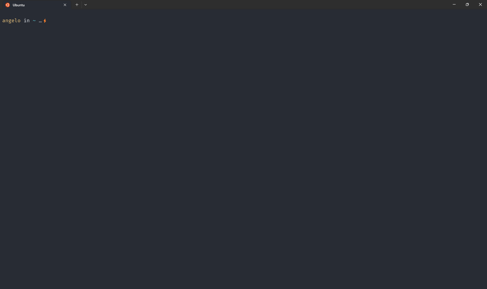

# Setting up ZSH manually

Setting up Zsh is usually accomplished with the use of a plugin manager, such as oh-my-zsh. However, such plugins often slows down the system and includes unnecessary plugins that you may not need or be aware of. The good news is that setting up Zsh manually is a quick process and doesn't require a god level knowledege of Linux.

## Requirements
- [WSL2](https://learn.microsoft.com/en-us/windows/wsl/install)
- [Windows Terminal](https://apps.microsoft.com/store/detail/windows-terminal/9N0DX20HK701)
> **Note** The `requirements` listed above are the ones needed to run Linux on a Windows machine. If you are using a Linux machine, you can skip this part.

## Setting up
### Step 1. Creating the directories and files. 
It's a good idea to manage all of your plugins, themes, and other configurations in a single location. This way, when you need to check or change something, you only have to look in that location

Create a directory `.zsh`. Inside of it, add the following directories `themes`, `plugins`, and `config`. Lastly, create the following files `.zshrc` and `.zsh_history`.

### Step 2. Installing and configuring themes.
I'm using [spaceship](https://spaceship-prompt.sh/) as my theme. However, feel free to choose any theme you prefer, as long as you follow the instructions provided by the theme's documentation.

Inside the `themes` directory, run the following 
```
git clone git@github.com:spaceship-prompt/spaceship-prompt.git
```
Inside the `config` directory, create `spaceship.zsh` file, and add the following
```
SPACESHIP_PROMPT_ORDER=(
  time           # Time stamps section
  user           # Username section
  dir            # Current directory section
  host           # Hostname section
  git            # Git section (git_branch + git_status)
  package        # Package version
  python         # Python section
  elm            # Elm section
  php            # PHP section
  docker         # Docker section
  docker_compose # Docker section
  aws            # Amazon Web Services section
  venv           # virtualenv section
  exec_time      # Execution time
  async          # Async jobs indicator
  line_sep       # Line break
  battery        # Battery level and status
  jobs           # Background jobs indicator
  exit_code      # Exit code section
  sudo           # Sudo indicator
  char           # Prompt character
)

# User
SPACESHIP_USER_SHOW=always
SPACESHIP_PROMPT_ADD_NEWLINE=true
SPACESHIP_PROMPT_SEPARATE_LINE=false
SPACESHIP_CHAR_SYMBOL="⚡"
SPACESHIP_CHAR_SUFFIX=" "
```

### Step 4. Installing plugins
Auto-suggestion is very useful, especially when you're having a hard time recalling every command you've run. Let's start by setting up [zsh-autosuggestions](https://github.com/zsh-users/zsh-autosuggestions), which provides auto-suggestions in Zsh.

Inside the `plugins` directory, run the following
```
git clone git@github.com:zsh-users/zsh-autosuggestions.git
```

### Step 5. Configuring .zshrc
Open .zshrc and paste the following
```
# PATH
export PATH=~/bin:$PATH

# ZSH
export ZSH=$HOME/.zsh

# HISTORY
export HISTFILE=$ZSH/.zsh_history
export HISTSIZE=10000
export SAVEHIST=10000
setopt HIST_IGNORE_ALL_DUPS
setopt HIST_FIND_NO_DUPS

# THEMES
# --- Spaceship
source $HOME/.zsh/config/spaceship.zsh
source $ZSH/themes/spaceship-prompt/spaceship.zsh-theme

# Plugins
# --- Autosuggestions
source $ZSH/plugins/zsh-autosuggestions/zsh-autosuggestions.zsh

# ALIAS
alias ls='ls --color=auto'
#alias dir='dir --color=auto'
#alias vdir='vdir --color=auto'
alias grep='grep --color=auto'
alias fgrep='fgrep --color=auto'
alias egrep='egrep --color=auto'
```
> **Note** Please ensure to check your PATH configuration as it may differ from mine. Modifying it incorrectly can potentially break your shell.

### Step 6. Linking .zsh
Run the following commands
```
ln -s -T .zsh/.zshrc .zshrc
```

### Step 7. Testing
Reload your shell or run `source ~.zshrc`.

## Final output

> **Note** Icons may appear different or may not be displayed at all. Make sure you are using [FiraCode](https://github.com/tonsky/FiraCode/wiki/Installing) as the font for your terminal. 

## Made a change?
simply repeat step number 7